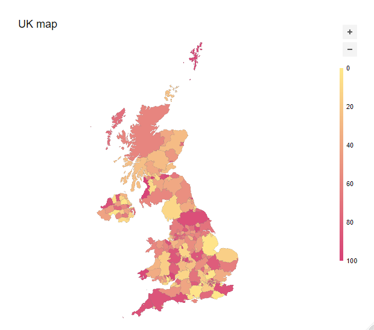

# tuichartr

> Htmlwidget to create interactive visualisations with JavaScript library [tui-chart](https://github.com/nhn/tui.chart)

[](https://travis-ci.org/dreamRs/tuichartr)
[](https://www.repostatus.org/#wip)
[](https://www.tidyverse.org/lifecycle/#experimental)


## Installation

You can install from GitHub with:

``` r
remotes::install_github("dreamRs/tuichartr")
```

## Charts

You can create various type of chart : bar, column, line, area, boxplot, scatter, heatmap, treemap, radar, pie.

``` r
library(gapminder)
library(tuichartr)

# Datas
n_countries <- gapminder %>% 
  filter(year == 2007) %>% 
  count(continent, sort = TRUE)

# Chart
tuichart("bar") %>% 
  add_data(n_countries, aes(x = continent, y = n)) %>% 
  tui_chart(title = "Countries by continent in 2007") %>% 
  tui_xAxis(title = "Number of countries") %>% 
  tui_legend(visible = FALSE) %>% 
  tui_series(showLabel = TRUE)
```


## Maps

You can also make maps :

```r
# Retrieve Italy polygons
uk <- ne_states("united kingdom", returnclass = "sf")
# add a random numeric variable
uk$random <- sample(1:100, nrow(uk), TRUE)

# draw map
tuimap() %>% 
  add_map_data(uk, aes(code = adm1_code, label = name, value = random)) %>% 
  tui_chart(title = "UK map")
```




